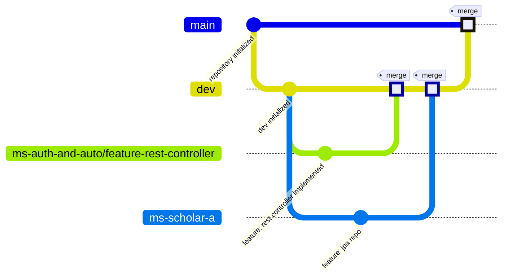
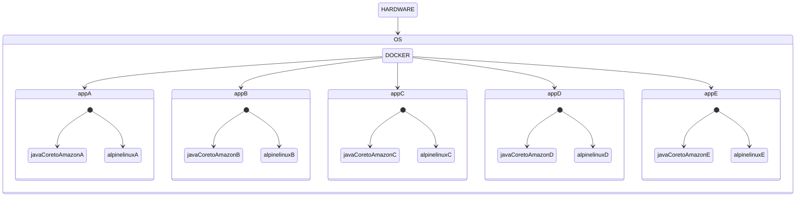
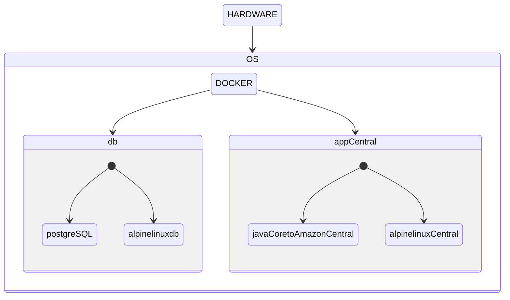
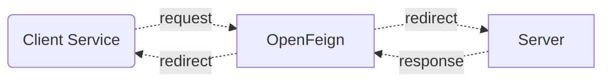
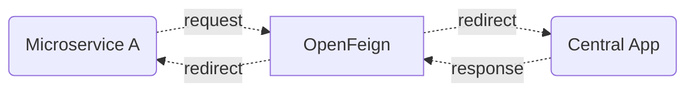

# Challenge II - Microservices Integration

> Use this table of contents to jump to the section you want

| Content                                      | Link                                                                                                       | Difficulty |
|:---------------------------------------------|:-----------------------------------------------------------------------------------------------------------|:----------:|
| About the challenge                          | [Go](https://github.com/Bruno-OA/challenge-week-VIII/tree/dev#about-the-challenge)                         |     -      |
| Timeline                                     | [Go](https://github.com/Bruno-OA/challenge-week-VIII/tree/dev#timeline)                                    |     -      |
| What the demands are                         | [Go](https://github.com/Bruno-OA/challenge-week-VIII/tree/dev#what-the-demands-are)                        |     -      |
| Project Structure                            | [Go](https://github.com/Bruno-OA/challenge-week-VIII/tree/dev#project-structure>)                          |   medium   |
| Central microservice                         | [Go](https://github.com/Bruno-OA/challenge-week-VIII/tree/dev#central-microservice)                        |    high    |
| Individuals microservice                     | [Go](https://github.com/Bruno-OA/challenge-week-VIII/tree/dev#individuals-microservice)                    |    high    |
| Usage of dockerfiles and docker-compose.yaml | [Go](https://github.com/Bruno-OA/challenge-week-VIII/tree/dev#usage-of-dockerfiles-and-docker-composeyaml) |   medium   |
| Unit tests                                   | [Go](https://github.com/Bruno-OA/challenge-week-VIII/tree/dev#unit-tests)                                  |    high    |
| Usage of OpenFeign                           | [Go](https://github.com/Bruno-OA/challenge-week-VIII/tree/dev#usage-of-openfeign)                          |   medium   |
| Postman collection                           | [Go](https://github.com/Bruno-OA/challenge-week-VIII/tree/dev#postman-collection)                          |    low     |

## About the challenge

Develop one main microservice as `ms-auth-and-auto` and five individual microservices as `ms-scholar-a`.  
Each individual microservice must comunicate with the main microservice

---

## Timeline

````mermaid
gantt
    title Project Progress
    dateFormat YYYY-MM-DD
    section  Structure
         desenvolvimento          : 2023-09-11, 3d
        
    section Central Ms
    desenvolvimento  :2023-09-11, 7d
        
    section Individuals Ms
    desenvolvimento          : 2023-09-16, 3d
        
    section Docker
    desenvolvimento : 2023-09-12, 8d
        
    section Unit Tests
    desenvolvimento    : 2023-09-18, 1d
    
    section OpenFeign
    desenvolvimento  :2023-09-16, 2d
    
    section Postman
    desenvolvimento  :2023-09-19, 1d
    

````

---


## What the demands are

---

> 1. The requirements for the project are listed on this section, just follow along.
> 2. Microservice specific requirements will be listed on their own sections

1. Usage of two fixed branches: main and dev

- `Main` branch will be used for the latest complete project version
- `Dev` branch will be used to assemble every feature developed before merging to main branch

2. Branches' **name pattern**: `[microservice-name]/feature-[feature-name]`



3. **Semantic commits** messages implementation, example below:

```git
 git commit -m "docs: updated README.md with new table of contents"
```

4. **README** as documentation

5. Usage of Docker with **docker-compose.yaml**

6. **Postman** or **Swagger** collection

7. Usage of at least one OneToMany, OneToOne or ManyToMany relation

---

## Project Structure

### Apresentation
- **Controller**: API controllers, responsible for receiving requests and sending responses.

### Application
- **DTOs**: Data Transfer Objects used to pass data between layers.
- **Interfaces**: Contracts for the services.
- **Services**: Contains high-level business logic and calls repository methods.

### Domain
- **Entities/Model**: Domain entities.
- **Interfaces**: Contracts for the Repositories.
- **Enums**: Enumerations used in entities and/or business rules.

### Infra
- **Config**: Project dependency configuration.
- **Constants**
- **Exceptions**: Exception configuration and its handler.

---

## Central microservice

The Central Microservice is designed to simulate the authentication and authorization of a user within a microservice. It consists of three controllers: `MicroserviceController`, `UserController`, and `UserMicroserviceRoleController`. Each controller has its own endpoints.

### MicroserviceController

The `MicroserviceController` has two endpoints:

1. `createMicroservice`: This endpoint is responsible for creating new microservices in the database.
2. `findById`: This endpoint is responsible for fetching a microservice by its ID from the database.

### UserController

The `UserController` has five endpoints:

1. `createUser`: This endpoint is responsible for creating a new user in the database.

2. `findById`: This endpoint is responsible for fetching a user by their ID from the database.

3. `bindUserToMicroserviceId`: This endpoint links a user to a microservice. The required parameters are `userId`, `microserviceId`, and `UserMicroserviceRequest` (a class that contains `emailUser` and `nameMicroservice`).

4. `getUsersAndPermissions`: This endpoint returns a list of users along with their linked microservices and permissions within those microservices.

5. `updateUserRoleInMicroservice`: This endpoint updates the user's role within the microservice. By default, when the user is linked to the microservice, their role is set as USER. With this endpoint, it's possible to change the user's role to ADMIN or from ADMIN to USER by passing the parameters: `userId`, `microserviceId`, and `newRole`.

### UserMicroserviceRoleController

The `UserMicroserviceRoleController` has three endpoints:

1. `getUsersByUserIdAndMicroserviceId`: This endpoint is responsible for searching for the relationship between the user and microservice and returns the user and the user's role within that microservice, passing as parameters: userId and microserviceId.

2. `getMicroserviceByMicroserviceId`: This endpoint validates if there is a microservice within UserMicroserviceRole, where the relationship between user and microservice is located. If the microservice exists within this relationship, the endpoint will return the microservice passed by parameter: microserviceId.

3. `getUsersByMicroserviceId`: This endpoint returns a list of users and their role linked to the microservice, parameter: microserviceId.

---

## Individuals microservice

### Commands to generate .jar file
``mvn clean package`` for each module or

``mvn clean package -DskipTests`` to skip all the tests and create a .jar lighter version

- For IntelliJ you can press ``ctrl ctrl`` and a Run Anything menu will pop up on your screen, just select a project within the Execution Context and then run the command above
- A ``target/`` folders will be generated automatically and from there we will copy the .jar file to the docker container

---

## Usage of dockerfiles and docker-compose.yaml
### What is docker
> Docker is an open platform for developing, shipping, and running applications. Docker enables you to separate your applications from your infrastructure, so you can deliver software quickly. [Source](https://docs.docker.com/get-started/overview/)

### Commands to use
``docker-compose build``
- To download and update the containers

``docker-compose up``
- To run the containers

### Dockerfile
> Each project has its own Dockerfile containing instructions to build the images

### docker-compose.yml
> This file sets how each container should act while running with docker
> While in development, we decided to use a specific designed by user netowrk to manage communication between the containers, setting fixed IPs to each microservice
 

### Containers
#### Individual Microservice container

#### DB container and Central Microservice container

---

## Unit tests

<details> <summary> MicroserviceService Test</summary>
<details> <summary> GetMicroserviceByIdAndUsersPermissions ( )</summary>

1. Test Method Signature: The test method is defined as public void estGetMicroserviceByIdAndUsersPermissions(). It doesn’t take any parameters and doesn’t return anything.
2. Test Setup: The test sets up the necessary data and mocks for the test. It initializes a microserviceId variable with the value 1L. Then, it creates a Microservice object named mockMicroservice with the name “Test Microservice”. Similarly, it creates a UserResponse object named mockUser with the name “Test User”. Finally, it creates a list of UserResponse objects named mockUsers and adds the mockUser object to it.
3. Mocking: The test uses the Mockito framework to mock the behavior of external dependencies. It mocks the behavior of the _userMicroserviceRoleFeign object by specifying the expected return values for its methods using the when method. Specifically, it expects the getMicroserviceByMicroserviceId method to return the mockMicroservice object   and the getUserByMicroserviceId method to return the mockUsers list.
4. Method Invocation: The test invokes the getMicroserviceByIdAndUsersPermissions method of the _microserviceService object with the microserviceId variable as an argument. It assigns the result to a variable named response.
5. Assertions: The test uses assertions to verify that the actual results match the expected results. It checks that:
6. The id property of the response object is equal to the microserviceId. The name property of the response object is equal to the name of the mockMicroservice. The users property of the response object is equal to the mockUsers list.

</details>

<details> <summary> GetMicroserviceByIdAndUsersPermissionsException ( )</summary>

1. Test Method Signature: The test method is defined as public void testGetMicroserviceByIdAndUsersPermissionsException(). It doesn’t take any parameters and doesn’t return anything.
2. Test Setup: The test sets up the necessary data and mocks for the test. It initializes a microserviceId variable with the value 1L.
3. Mocking: The test uses the Mockito framework to mock the behavior of external dependencies. It mocks the behavior   of the _userMicroserviceRoleFeign object by specifying that the getMicroserviceByMicroserviceId method should throw a RuntimeException when called with the microserviceId.
4. Exception Assertion: The test uses the assertThrows method to assert that calling the getMicroserviceByIdAndUsersPermissions method with the microserviceId will throw a UserMicroserviceRoleNotFoundException. This ensures that the method correctly handles exceptions and throws the expected exception when necessary. These assertions help verify that the method under test handles exceptions appropriately and throws the expected exception when an error occurs.

</details>


</details> 

<details> <summary> UserServiceTest</summary>


<details> <summary> findUserById ( ) </summary>

1. Test Method Signature: The test method is defined as public void testFindUserById(). It doesn’t take any parameters and doesn’t return anything.
2. Test Setup: The test sets up the necessary data and mocks for the test. It creates a UserMicroserviceRole object named userMicroserviceRole. It also creates a User object named user and sets its name to “Test User”. The userMicroserviceRole object is associated with the user object and has a role named “Test Role”.
3. Mocking: The test uses the Mockito framework to mock the behavior of external dependencies. It mocks the behavior of the _userMicroserviceRoleFeign object by specifying that the findById method should return the userMicroserviceRole object when called with the arguments 1L and 1L.
4. Method Invocation: The test invokes the findUserById method of the _userService object with the arguments 1L and 1L. It assigns the result to a variable named userResponse. 
5. Assertions: The test uses assertions to verify that the actual results match the expected results. It checks that:


</details>

<details> <summary> findUserByIdExcepetion ( ) </summary> 

1. Test Method Signature: The test method is defined as public void testFindUserByIdException(). It doesn’t take any parameters and doesn’t return anything.
2. Test Setup: The test sets up the necessary data and mocks for the test. It initializes a microserviceId variable with the value 1L.
3. Mocking: The test uses the Mockito framework to mock the behavior of external dependencies. It mocks the behavior of the _userMicroserviceRoleFeign object by specifying that the findById method should throw a RuntimeException when called with the microserviceId.
4. Exception Assertion: The test uses the assertThrows method to assert that calling the findUserById method with the microserviceId will throw a UserMicroserviceRoleNotFoundException. This ensures that the method correctly handles exceptions and throws the expected exception when necessary.
5. These assertions help verify that the method under test handles exceptions appropriately and throws the expected exception when an error occurs.

</details>

</details>


---

## Usage of OpenFeign
### What is OpenFeign
> One great thing about using Feign is that we don’t have to write any code for calling the service, other than an interface definition. [Source](https://www.baeldung.com/spring-cloud-openfeign)

### How does it work

> In this project's microservices OpenFeign is used to redirect a request using a RestTemplate to theCentral Microservice
> 
> The Central App's response is mapped to 


### Problems faced and how we solved it
1. Microservices could not communicate with the other containers
> For this the solution was to use a dynamic URL for the `@FeignClient(name = "ms-auth-and-auth", url = "${client.post.baseUrl}")`
> 
> Also, we set three application.yml. A standard, an a`pplication-DOCKER.yml` and an `application-LOCAL.yml`.
> 
> Disregarding the standard .yml file, there are different `{client.post.baseUrl}` instructions
>  1. DOCKER: fixed IP adress at `172.23.0.2`
>  2. LOCAL: standard `localhost`
> 
> While using outside docker environment, you should set LOCAL as the active profile 
> 
> While inside docker environment, you should set DOCKER as the active profile
> 
> **But, remember to do that before building the images and the containers**


---

## Postman collection
You can see the Postman Collection as a .json file [here](https://github.com/Bruno-OA/challenge-week-VIII/blob/dev/Challenger%20II.postman_collection.json)
> Use the links below to get to the URLs

| Central Microservice            | Name                            | Http method | Link                                                                                                                | Body / Query                                                         | 
|---------------------------------|---------------------------------|-------------|---------------------------------------------------------------------------------------------------------------------|----------------------------------------------------------------------|
| user-controller                 | findById                        | GET         | [Go](http://localhost:8080/ms-auth-and-auto/api/users/{id})                                                         | -                                                                    |
| user-controller                 | getUsersAndPermissions          | GET         | [Go](http://localhost:8080/ms-auth-and-auto/api/users)                                                              | -                                                                    | 
| user-controller                 | createUser                      | POST        | [Go](http://localhost:8080/ms-auth-and-auto/api/users)                                                              | { "name": "name", "email": "email", "password": "password" }         |
| user-controller                 | bindUserToMicroservice          | PUT         | [Go](http://localhost:8080/ms-auth-and-auto/api/users/{userId}/microservice/{microserviceId})                       | { "emailUser": "emailUser", "nameMicroservice": "nameMicroservice" } |
| user-controller                 | updateUserRoleInMicroservice    | PUT         | [Go](http://localhost:8080/ms-auth-and-auto/api/users/{userId}/microservice/{microserviceId}/update-role)           | { "key": "newRole", "value": "USER"}                                 |
| microservice-controller         | createMicroservice              | POST        | [Go](http://localhost:8080/ms-auth-and-auto/api/microservices)                                                      | { "name": "nameMicroservice"}                                        |
| microservice-controller         | findById                        | GET         | [Go](http://localhost:8080/ms-auth-and-auto/api/microservices/{id})                                                 | -                                                                    |
| userMicroserviceRole-controller | getUserMicroserviceRole         | GET         | [Go](http://localhost:8080/ms-auth-and-auto/api/userMicroserviceRole/user/{id-user}/microservice/{id-microservice}) | -                                                                    |
| userMicroserviceRole-controller | getMicroserviceByMicroserviceId | GET         | [Go](http://localhost:8080/ms-auth-and-auto/api/userMicroserviceRole/{microserviceId})                              | -                                                                    |
| userMicroserviceRole-controller | getUsersByMicroserviceId        | GET         | [Go](http://localhost:8080/ms-auth-and-auto/api/userMicroserviceRole/{microserviceId}/users)                        | -                                                                    |

> Microservice A
>
| Related Controller      | Name                                   | Http method | Link                                                                                |
|-------------------------|----------------------------------------|-------------|-------------------------------------------------------------------------------------|
| user-controller         | findUserByIdAndMicroserviceId          | GET         | [Go](http://localhost:8081/ms-a/api/scholar/{userId}/microservice/{microserviceId}) |
| microservice-controller | getMicroserviceByIdAndUsersPermissions | GET         | [Go](http://localhost:8081/ms-a/api/scholar/microservice/{microserviceId})          |
> Microservice B
>
| Related Controller      | Name                                   | Http method | Link                                                                                |
|-------------------------|----------------------------------------|-------------|-------------------------------------------------------------------------------------|
| user-controller         | findUserByIdAndMicroserviceId          | GET         | [Go](http://localhost:8082/ms-b/api/scholar/{userId}/microservice/{microserviceId}) |
| microservice-controller | getMicroserviceByIdAndUsersPermissions | GET         | [Go](http://localhost:8082/ms-b/api/scholar/microservice/{microserviceId})          |
> Microservice C
>
| Related Controller      | Name                                   | Http method | Link                                                                                |
|-------------------------|----------------------------------------|-------------|-------------------------------------------------------------------------------------|
| user-controller         | findUserByIdAndMicroserviceId          | GET         | [Go](http://localhost:8083/ms-c/api/scholar/{userId}/microservice/{microserviceId}) |
| microservice-controller | getMicroserviceByIdAndUsersPermissions | GET         | [Go](http://localhost:8083/ms-c/api/scholar/microservice/{microserviceId})          |
> Microservice D
>
| Related Controller      | Name                                   | Http method | Link                                                                                |
|-------------------------|----------------------------------------|-------------|-------------------------------------------------------------------------------------|
| user-controller         | findUserByIdAndMicroserviceId          | GET         | [Go](http://localhost:8084/ms-d/api/scholar/{userId}/microservice/{microserviceId}) |
| microservice-controller | getMicroserviceByIdAndUsersPermissions | GET         | [Go](http://localhost:8084/ms-d/api/scholar/microservice/{microserviceId})          |
> Microservice E
>
| Related Controller      | Name                                   | Http method | Link                                                                                |
|-------------------------|----------------------------------------|-------------|-------------------------------------------------------------------------------------|
| user-controller         | findUserByIdAndMicroserviceId          | GET         | [Go](http://localhost:8085/ms-e/api/scholar/{userId}/microservice/{microserviceId}) |
| microservice-controller | getMicroserviceByIdAndUsersPermissions | GET         | [Go](http://localhost:8085/ms-e/api/scholar/microservice/{microserviceId})          |

---
