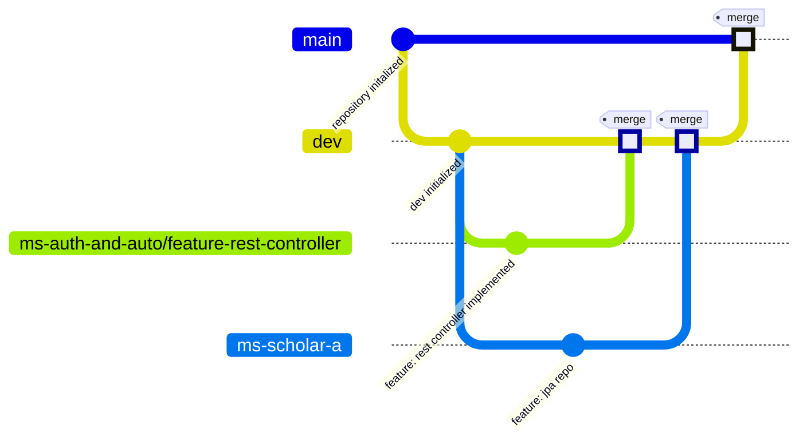

# Challenge II - Microservices Integration

> Use this table of contents to jump to the section you want

| Content                                      | Link                    | Difficulty |
|:---------------------------------------------|:------------------------|:----------:|
| About the challenge                          | [Go](<insert the link>) |     -      |
| What the demands are                         | [Go](<insert the link>) |     -      |
| Central microservice                         | [Go](<insert the link>) |    high    |
| Individuals microservice                     | [Go](<insert the link>) |    high    |
| Usage of dockerfiles and docker-compose.yaml | [Go](<insert the link>) |   medium   |
| Unit tests                                   | [Go](<insert the link>) |    high    |
| Usage of OpenFeign                           | [Go](<insert the link>) |   medium   |
| Postman collection                           | [Go](<insert the link>) |    low     |

## About the challenge

Develop one main microservice as `ms-auth-and-auto` and five individual microservices as `ms-scholar-a`.  
Each individual microservice must comunicate with the main microservice

---

## What the demands are

---

> 1. The requirements for the project are listed on this section, just follow along.
> 2. Microservice specific requirements will be listed on their own sections

1.Usage of two fixed branches: main and dev

- `Main` branch will be used for the latest complete project version
- `Dev` branch will be used to assemble every feature developed before merging to main branch

2.Branches' **name pattern**: `[microservice-name]/feature-[feature-name]`



3.**Semantic commits** messages implementation, example below:

```git
 git commit -m "docs: updated README.md with new table of contents"
```

4.**README** as documentation
5.Usage of Docker with **docker-compose.yaml**
6.**Postman** or **Swagger** collection
7.Usage of at least one OneToMany, OneToOne or ManyToMany relation

## Project Structure

### Apresentation
- **Controller**: API controllers, responsible for receiving requests and sending responses.

### Application
- **DTOs**: Data Transfer Objects used to pass data between layers.
- **Interfaces**: Contracts for the services.
- **Services**: Contains high-level business logic and calls repository methods.

### Domain
- **Entities/Model**: Domain entities.
- **Interfaces**: Contracts for the Repositories.
- **Enums**: Enumerations used in entities and/or business rules.

### Infra
- **Config**: Project dependency configuration.
- **Constants**
- **Exceptions**: Exception configuration and its handler.

## Central microservice

The Central Microservice is designed to simulate the authentication and authorization of a user within a microservice. It consists of three controllers: `MicroserviceController`, `UserController`, and `UserMicroserviceRoleController`. Each controller has its own endpoints.

### MicroserviceController

The `MicroserviceController` has two endpoints:

1. `createMicroservice`: This endpoint is responsible for creating new microservices in the database.
2. `findById`: This endpoint is responsible for fetching a microservice by its ID from the database.

### UserController

The `UserController` has five endpoints:

1. `createUser`: This endpoint is responsible for creating a new user in the database.
2. `findById`: This endpoint is responsible for fetching a user by their ID from the database.
3. `bindUserToMicroserviceId`: This endpoint links a user to a microservice. The required parameters are `userId`, `microserviceId`, and `UserMicroserviceRequest` (a class that contains `emailUser` and `nameMicroservice`).
4. `getUsersAndPermissions`: This endpoint returns a list of users along with their linked microservices and permissions within those microservices.
5. `updateUserRoleInMicroservice`: This endpoint updates the user's role within the microservice. By default, when the user is linked to the microservice, their role is set as USER. With this endpoint, it's possible to change the user's role to ADMIN or from ADMIN to USER by passing the parameters: `userId`, `microserviceId`, and `newRole`.

### UserMicroserviceRoleController

The `UserMicroserviceRoleController` has three endpoints:

1. `getUsersByUserIdAndMicroserviceId`: This endpoint is responsible for searching for the relationship between the user and microservice and returns the user and the user's role within that microservice, passing as parameters: userId and microserviceId.
2. `getMicroserviceByMicroserviceId`: This endpoint validates if there is a microservice within UserMicroserviceRole, where the relationship between user and microservice is located. If the microservice exists within this relationship, the endpoint will return the microservice passed by parameter: microserviceId.
3. `getUsersByMicroserviceId`: This endpoint returns a list of users and their role linked to the microservice, parameter: microserviceId.

---

## Individuals microservice

---

## Use of dockerfiles and docker-compose.yaml

---

## Unit tests

---

## Use of OpenFeign

---

## Postman collection

---
