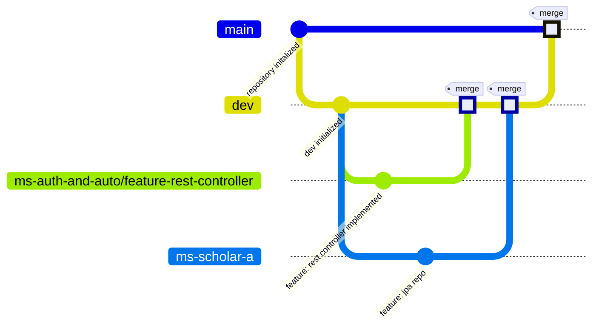

# Challenge II - Microservices Integration

> Use this table of contents to jump to the section you want

| Content                                      | Link                    | Difficulty |
|:---------------------------------------------|:------------------------|:----------:|
| About the challenge                          | [Go](<insert the link>) |     -      |
| What the demands are                         | [Go](<insert the link>) |     -      |
| Central microservice                         | [Go](<insert the link>) |    high    |
| Individuals microservice                     | [Go](<insert the link>) |    high    |
| Usage of dockerfiles and docker-compose.yaml | [Go](<insert the link>) |   medium   |
| Unit tests                                   | [Go](<insert the link>) |    high    |
| Usage of OpenFeign                           | [Go](<insert the link>) |   medium   |
| Postman collection                           | [Go](<insert the link>) |    low     |

## About the challenge

Develop one main microservice as `ms-auth-and-auto` and five individual microservices as `ms-scholar-a`.  
Each individual microservice must comunicate with the main microservice

---

## What the demands are

---

> 1. The requirements for the project are listed on this section, just follow along.
> 2. Microservice specific requirements will be listed on their own sections

1.Usage of two fixed branches: main and dev

- `Main` branch will be used for the latest complete project version
- `Dev` branch will be used to assemble every feature developed before merging to main branch

2.Branches' **name pattern**: `[microservice-name]/feature-[feature-name]`



3.**Semantic commits** messages implementation, example below:

```git
 git commit -m "docs: updated README.md with new table of contents"
```

4.**README** as documentation
5.Usage of Docker with **docker-compose.yaml**
6.**Postman** or **Swagger** collection
7.Usage of at least one OneToMany, OneToOne or ManyToMany relation

## Central microservice

---

## Individuals microservice

---

## Use of dockerfiles and docker-compose.yaml

---

## Unit tests

---

## Use of OpenFeign

---

## Postman collection

---
